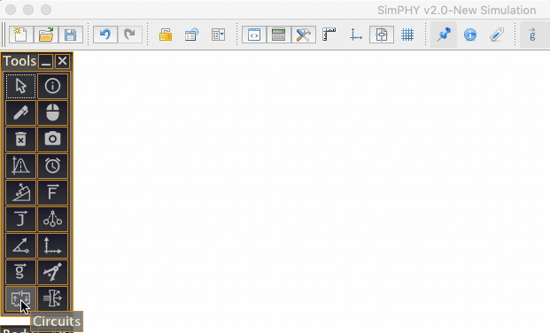

# simphy
2D Rigid Body Physics simulator

                                                                **OPTICS Tutorial**

1. 
**How to open optics simulation tool in simphy**
Simphy 2.0 comes with a Geometrical optics simulator (pro version only) tightly integrated with its geometry tools. The toolbar consists of 4 sections

1. Optical sources: rays, beam etc
2. Ideal Optical devices: lens and mirrors
3. Real Devices: Arbitrary surface creation tools to create prism etc
4. Observer and blocker

        You will find the tool in the visualisation toolbar as shown below. 

    

>>>>>  gd2md-html alert: inline image link here (to images/image1.gif). Store image on your image server and adjust path/filename/extension if necessary.  (<a href="#">Back to top</a>)(<a href="#gdcalert2">Next alert</a>) >>>>> 

2. **Adding Optical sources **

You can add optical sources like

1. Ray: Single ray passing through 2 points
2. Beam: Bundle of parallel rays
3. Point Source: Rays originating from a point
4. White ray: Achromatic ray passing through 2 points

>>>>>  gd2md-html alert: inline image link here (to images/image2.png). Store image on your image server and adjust path/filename/extension if necessary.  (<a href="#">Back to top</a>)(<a href="#gdcalert3">Next alert</a>) >>>>> 

Click the triangle at the first icon of the optics toolbar to open the ray menu tool. Follow the instructions to create different types of rays given in the status-bar at  bottom. 

In below GIF you can see how a ray, beam, point source and a white light ray is constructed.

>>>>>  gd2md-html alert: inline image link here (to images/image3.gif). Store image on your image server and adjust path/filename/extension if necessary.  (<a href="#">Back to top</a>)(<a href="#gdcalert4">Next alert</a>) >>>>> 

For eg - If you want to create a beam of light click the first point where the beam is gonna start, then click on the second point a beam will be formed. 

**Note**: if you choose the points on any axis or curve that point will be bound to move on that curve only.

3. **Adding Ideal Optical Devices**

You can add optical devices like

1. Convex and concave Lens
2. Convex and concave mirror
3. Plane mirror

Click the following triangular icon to open this toolbar

>>>>>  gd2md-html alert: inline image link here (to images/image4.png). Store image on your image server and adjust path/filename/extension if necessary.  (<a href="#">Back to top</a>)(<a href="#gdcalert5">Next alert</a>) >>>>> 

You can create an optical device like an ideal mirror or lens using this tool menu by selecting/creating 2 points.

**Note**: These optical instruments will act as ideal in nature following the reflection and refraction properties strictly without showing any spherical or chromatic aberration.

**Note**: As soon as you add a lens a property table will open on the left hand side, you can edit the properties like show-axis, show focus, rays-color, change focal length (you can enter variable expression here as shown in below gif) by this property table. \

>>>>>  gd2md-html alert: inline image link here (to images/image5.gif). Store image on your image server and adjust path/filename/extension if necessary.  (<a href="#">Back to top</a>)(<a href="#gdcalert6">Next alert</a>) >>>>> 

**Note**: if you want a concave mirror just make the focal length negative.In the same manner you can add ideal mirrors too.

4. **How to show Images**

There two ways to see images formed by any lens, mirror or surface

1. Click on the “Show Image” check box in the property table of any mirror/lens.
2. Add observer- It will act as a human eye and will plot the exact point of image of the rays incident to it.

    

>>>>>  gd2md-html alert: inline image link here (to images/image6.png). Store image on your image server and adjust path/filename/extension if necessary.  (<a href="#">Back to top</a>)(<a href="#gdcalert7">Next alert</a>) >>>>> 

Note: you can completely block images by using the blocker tool

**Example to view images: **

>>>>>  gd2md-html alert: inline image link here (to images/image7.gif). Store image on your image server and adjust path/filename/extension if necessary.  (<a href="#">Back to top</a>)(<a href="#gdcalert8">Next alert</a>) >>>>> 

Here it shows both the ways of viewing an image.

**Note**: You can change the amount of rays that an observer should collect to form an image from its property table.

5. **Creating arbitrary surface**

 Use this icon to open the toolbar

>>>>>  gd2md-html alert: inline image link here (to images/image8.png). Store image on your image server and adjust path/filename/extension if necessary.  (<a href="#">Back to top</a>)(<a href="#gdcalert9">Next alert</a>) >>>>> 

You can create real devices which can show partial reflection, spherical aberration and chromatic aberration.

1. Curved mirror
2. Plane refracting surface
3. Arbitrary surface

To create arbitrary surfaces

1. Select the starting point of the surface lets say A.
2. Now keep on adding points to create straight edges of the surface
3. To form a curved edge, click at a point, don't leave the mouse button and just drag down the mouse you will see a curved edge changing dynamically.
4. Note: to end the creation of the surface, either left click on the starting point, or right click anywhere.

Here the arbitrary surface is extremely useful to create real lens, prism, slabs etc which support properties like partial reflection, refractive index and dispersion each of which can take variable expression as input as shown in below gif. \

>>>>>  gd2md-html alert: inline image link here (to images/image9.gif). Store image on your image server and adjust path/filename/extension if necessary.  (<a href="#">Back to top</a>)(<a href="#gdcalert10">Next alert</a>) >>>>> 

6. 
**Creating an Interactive Optics simulation : A telescope**
Follow the steps  below to create an interactive basic astronomical telescope

1. Add two lenses left larger and right smaller on these lines.
2. Add parallel beam to the left that will act as distant object
3. Disable images of both objective and eyepiece lens
4. Add slider and set focal length of the objective lenses to that slider value.
5. Add observer
6. Create a FREE point where  the image is formed by the observer. 
7. Create a vector that will act as an image. Now change the slider value to form different sizes of images.

>>>>>  gd2md-html alert: inline image link here (to images/image10.gif). Store image on your image server and adjust path/filename/extension if necessary.  (<a href="#">Back to top</a>)(<a href="#gdcalert11">Next alert</a>) >>>>> 

